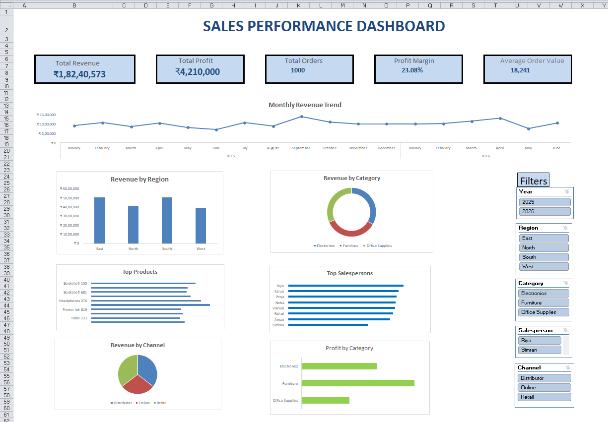

# 📊 Sales Performance Dashboard (Microsoft Excel)

## 📌 Project Overview

This project is an interactive Sales Performance Dashboard built entirely in Microsoft Excel to analyze sales data and support business decision-making.

The dashboard transforms raw transactional data into meaningful insights using Pivot Tables, Pivot Charts, Slicers, and Excel formulas, enabling users to monitor key business metrics, identify trends, and evaluate sales performance across multiple dimensions.

---

## 🎯 Business Objective

The objective of this dashboard is to help business stakeholders answer questions such as:

- Which region generates the highest revenue?
- How are monthly sales changing over time?
- Which product categories contribute the most revenue?
- Who are the top-performing salespersons?
- Which sales channels perform best?
- What is the overall profit margin?
- How do different filters impact business performance?

---

## 🛠 Tools & Features Used

- Microsoft Excel
- Pivot Tables
- Pivot Charts
- Slicers
- Excel Formulas
- Conditional Formatting
- Dashboard Design
- KPI Cards
- Data Visualization

---

## 📊 Dashboard Preview



---

## 📈 Key Performance Indicators (KPIs)

The dashboard provides an overview of the following business metrics:

- Total Revenue
- Total Profit
- Total Orders
- Profit Margin
- Average Order Value

These KPIs provide a quick snapshot of overall business performance.

---

## 📊 Dashboard Components

### 📅 Monthly Revenue Trend

Tracks revenue performance over time to identify seasonal patterns and business growth.

---

### 🌍 Revenue by Region

Compares revenue generated across different regions to highlight geographical performance.

---

### 🛍 Revenue by Category

Displays the contribution of each product category to overall sales.

---

### 🏆 Top Products

Identifies the highest-performing products based on revenue.

---

### 👨‍💼 Top Salespersons

Highlights the best-performing sales representatives.

---

### 🛒 Revenue by Channel

Analyzes sales generated through different sales channels.

---

### 💰 Profit by Category

Compares profitability across product categories.

---

## 🎛 Interactive Filters

The dashboard includes dynamic slicers allowing users to filter the report by:

- Year
- Region
- Category
- Salesperson
- Sales Channel

These filters automatically update all visualizations, enabling interactive data exploration.

---

## 💡 Business Insights

Some key insights that can be derived from the dashboard include:

- Compare sales performance across different regions.
- Identify top-performing products and sales representatives.
- Monitor monthly revenue trends.
- Evaluate category-wise profitability.
- Analyze sales channel contribution.
- Track overall business performance through KPIs.

---

## 📁 Project Structure

```
Sales-Performance-Dashboard/
│
├── Sales Dashboard.xlsx
├── README.md
└── images/
    ├── dashboard-overview.png
    ├── kpi-overview.png
    ├── monthly-trend.png
    ├── regional-analysis.png
    ├── top-products.png
    └── filtered-dashboard.png
```

---

## 📚 Skills Demonstrated

This project demonstrates practical skills in:

- Data Cleaning
- Data Analysis
- Dashboard Development
- KPI Design
- Business Intelligence Reporting
- Data Visualization
- Excel Automation using Pivot Tables
- Analytical Thinking
- Business Storytelling

---

## 🚀 Potential Business Applications

This dashboard can support decision-making for:

- Sales Managers
- Business Analysts
- Commercial Teams
- Retail Planning
- Merchandising Teams
- Management Reporting

---

## 📌 Dataset

This dashboard was created using a sample sales dataset for portfolio and learning purposes.

---

## 👤 Author

**Sahil Paruthi**

Aspiring Business Analyst | Data Analytics
